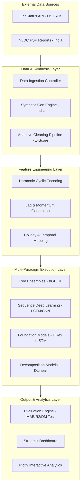
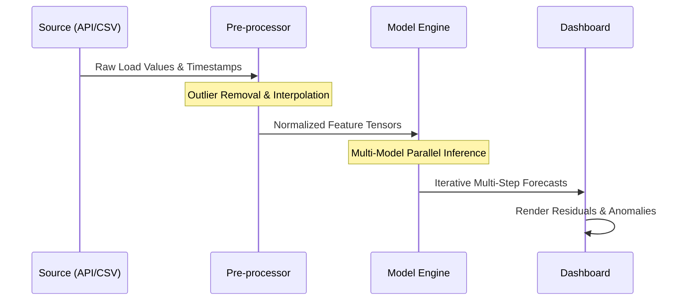
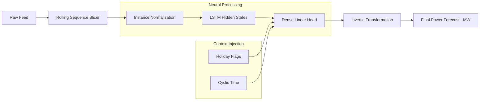
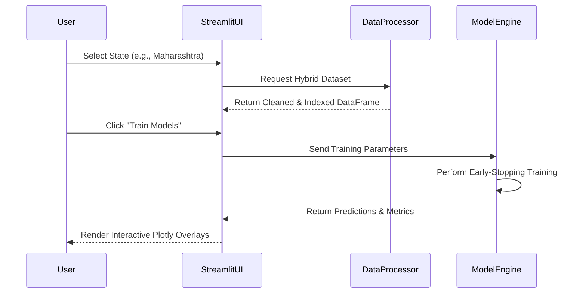

# Chapter 7: System Design / Implementation & Methodology

## 7.1 Proposed Architecture
The GridOne framework is designed using a modular, service-oriented architecture that separates data acquisition, stateful processing, and interactive visualization. The high-level pipeline is structured to support both synchronous real-time API fetches (US) and asynchronous batch processing (India).

### 7.1.1 Macro-Architecture Block Diagram
The following diagram illustrates the structural relationship between the various layers of the system:



---

## 7.2 Data Flow Diagrams (DFD)
The movement of data through the system is prioritized for low-latency inference and high-fidelity historical reconstruction. 

### 7.2.1 Level 0: Global Data Flow
The high-level flow from raw input to prediction dashboard:



### 7.2.2 Level 1: Deep Modeling Data Flow
A more granular view of how data is transformed within the Deep Learning pipeline (specifically for LSTM and TiRex models):



---

## 7.3 UML Diagrams
UML diagrams provide a standardized view of the actors, interactions, and internal logic of the GridOne ecosystem.

### 7.3.1 Use Case Diagram
Describes the functional requirements from the perspective of the Researcher or Grid Operator.

```mermaid
useCaseDiagram
    actor Researcher
    actor GridOperator
    
    Researcher --> (Select Market & Region)
    Researcher --> (Compare Model Suitability)
    
    GridOperator --> (View Real-Time Load)
    GridOperator --> (Analyze Demand Anomalies)
    GridOperator --> (Review Future Forecasts)
    
    (Select Market & Region) ..> (Fetch API Data) : include
    (Compare Model Suitability) ..> (Execute Train/Test Split) : include
```

### 7.3.2 System Sequence Diagram (UI to Model Engine)
Shows the interaction flow during a typical training and evaluation session.



---

## 7.4 Dataset Description
The framework operates on two distinct datasets characterized by different granularities and sources.

-   **US Market Dataset:** 
    -   **Samples:** Approximately 8,760 samples per ISO per year (Hourly frequency).
    -   **Task:** Time-series Regression.
    -   **Target:** `Load` measured in Megawatts (MW).
-   **India State Dataset:** 
    -   **Samples:** Approximately 365–730 samples per state (1-2 years of daily records).
    -   **Total States:** 37 (States and Union Territories).
    -   **Target:** `Day Demand` measured in Million Units (MU).
-   **Classes:** Not applicable (Regression task); however, regional classification (North, South, East, West, Central) is used for seasonal modeling.

---

## 7.5 Data Pre-processing
The pre-processing pipeline follows a deterministic four-step sequence to ensure input stability:
1.  **Handling Missing Values:** Linear interpolation is applied for gaps of <6 hours (US) or <2 days (India). For larger gaps, forward-filling is utilized to preserve the most recent trend.
2.  **Normalization:** Sequence-based models (LSTM, TiRex, DLinear) utilize **StandardScaler** to map load values to a distribution with $\mu=0$ and $\sigma=1$ to prevent gradient explosion.
3.  **Data Augmentation:** For states with sparse historical records, the **Physics-Informed Synthetic Generator** creates augmented time series based on regional base loads and sinusoidal seasonality.
4.  **Target Ratios (India):** For the India mode, load values are often normalized by the state's peak capacity to allow cross-state model generalization.

---

## 7.6 Feature Engineering
Feature selection is driven by temporal relevance and correlation analysis.
-   **Extraction Techniques:**
    -   **Correlation Matrix Analysis:** Used to verify the relationship between lags (e.g., Lag_24h and Lag_168h) and the target load to select the most predictive windows.
    -   **Cyclic Feature Transformation:** Converting ordinal month/day values into Sin/Cos components.
-   **Selection:** The final feature vector for each timestep includes:
    -   Auto-regressive Lags (t-1 to t-30).
    -   Rolling Statistics (3-day Mean, 7nd-day volatility).
    -   Exogenous Indicators (Holidays, Weekend binary flags).

---

## 7.7 Algorithm Selection
We selected a "Multi-Paradigm" suite to ensure the framework remains robust across different grid dynamics.
-   **Champion Model (Tabular): XGBoost.** Chosen for its superior handling of non-linear interactions between engineered features and its high training speed.
-   **Champion Model (Sequence): TiRex (xLSTM).** A foundation model selected for its ability to perform high-accuracy zero-shot inference without the stability issues of standard Transformers.
-   **Statistical Baseline: SARIMA.** Selected for its rigor in modeling auto-regressive and moving average components with explicit seasonality.
-   **Efficiency Champion: DLinear.** A lightweight decomposition model that achieves high accuracy by independently modeling trend and seasonality.

---

## 7.8 Model Training
Training is managed through a unified controller that handles hardware delegation and hyperparameter optimization.
-   **Optimizer:** **Adam Optimizer** is used for ALL neural architectures (LSTM, CNN, DLinear) due to its adaptive learning rate capabilities.
-   **Loss Function:** **Mean Squared Error (MSE)** is the primary loss for backpropagation, as it heavily penalizes the large errors that can destabilize grid planning.
-   **Hyperparameter Tuning:** 
    -   **Early Stopping:** Monitors validation $R^2$ with a patience of 15–20 epochs to prevent overfitting.
    -   **Regularization:** L1/L2 regularization (XGBoost) and Dropout layers (LSTM/CNN) at 10-20% rates.
    -   **Learning Rate Scheduling:** Conservative static rates (0.001 to 0.05) are used to ensure convergence on smaller regional datasets.
