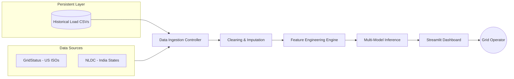
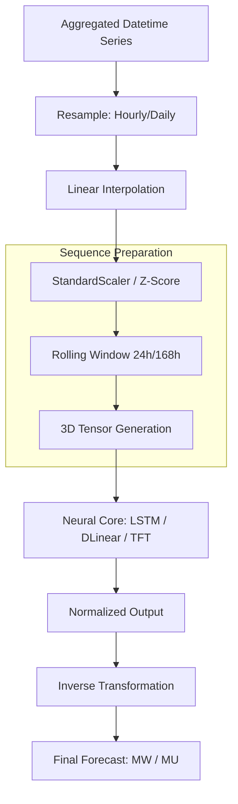
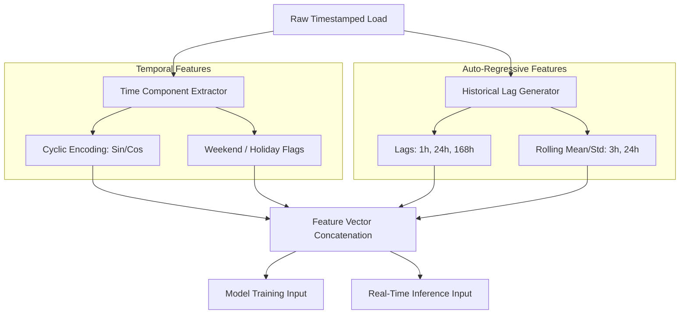
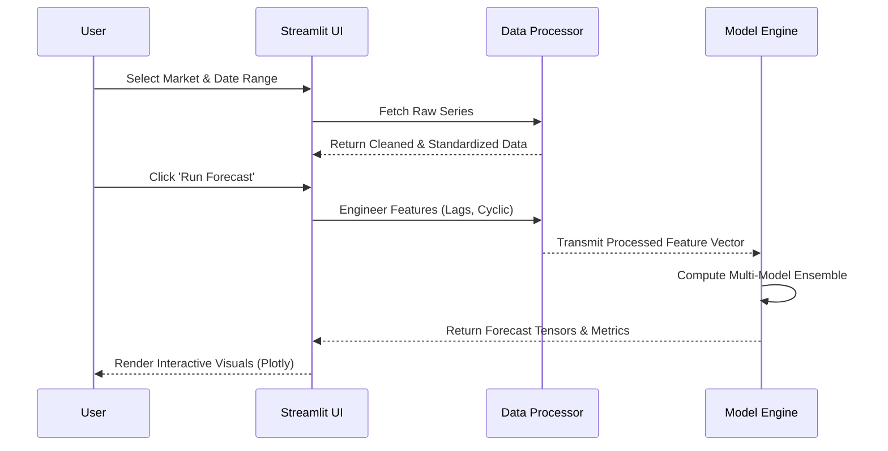
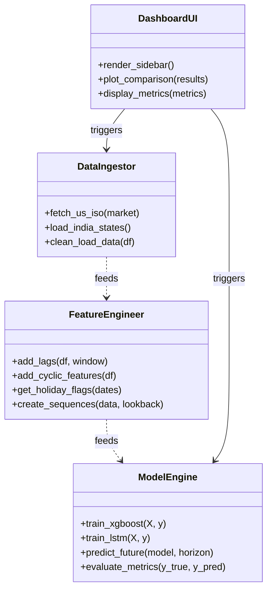

# System Architecture and Process Diagrams (Chapter 7)

This document contains standardized Mermaid visualizations for the **GridOne** forecasting framework, covering data movement, feature transformations, and system interactions.

---

## 1. Data Flow Diagrams (DFD)

### 1.1 Level 0: Global Data Flow
Visualizing the end-to-end journey from the physical power grid sensors (via APIs) to the operator's dashboard.



### 1.2 Level 1: Modeling Pipeline
Detailing the internal data lifecycle within the deep learning forecasting modules.



---

## 2. Feature Engineering Process Diagram

Visualization of the transformation logic where raw timestamps and load values are converted into predictive signals.



---

## 3. UML Diagrams

### 3.1 Use Case Diagram
User interactions with the GridOne forecasting system.

```mermaid
useCaseDiagram
    actor "Researcher / Analyst" as Analyst
    actor "System Operator" as Operator
    
    package "GridOne Forecasting Platform" {
        usecase "Compare Models (R², MAPE)" as UC1
        usecase "Select Geographic Market" as UC2
        usecase "Analyze Anomalies" as UC3
        usecase "Generate Future Forecasts" as UC4
        usecase "Hyperparameter Tuning" as UC5
    }
    
    Analyst --> UC1
    Analyst --> UC2
    Analyst --> UC5
    
    Operator --> UC2
    Operator --> UC3
    Operator --> UC4
```

### 3.2 System Sequence Diagram
The interaction between the UI layer and the modeling orchestration logic.



### 3.3 Class Diagram (Logical Architecture)
Representation of the modular code structure of the forecasting framework.


