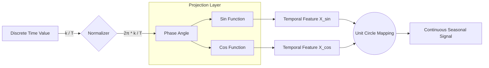
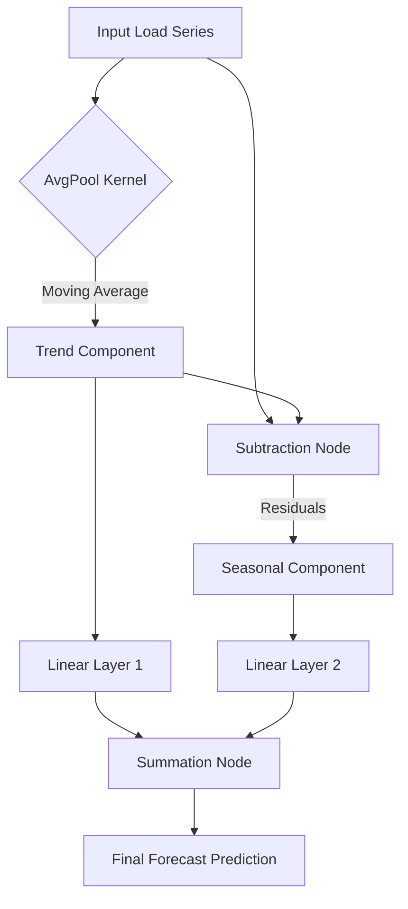
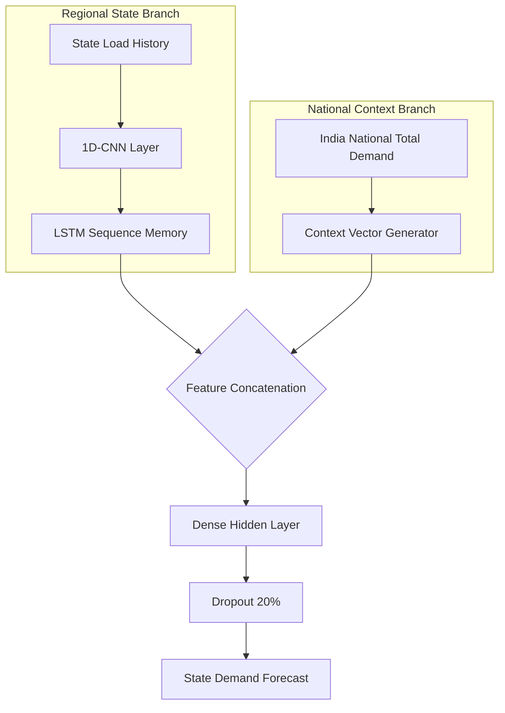
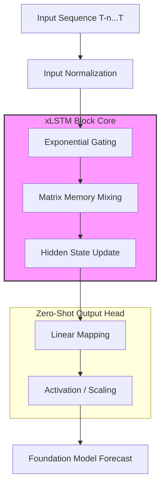
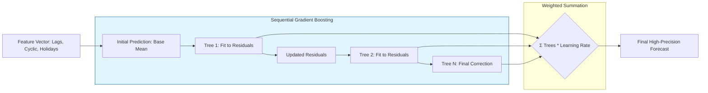
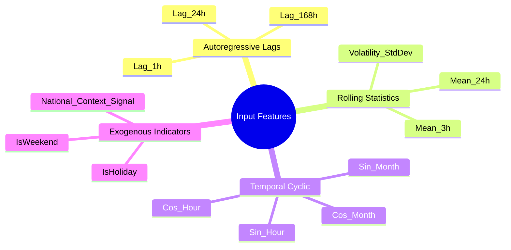
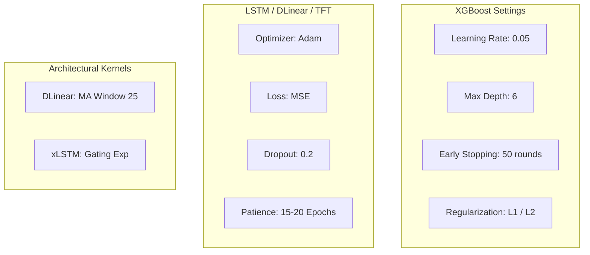

# List of Recommended Figures and Tables

This document outlines the essential visual and tabular assets recommended for inclusion in the final project report and research paper. These selections emphasize the framework's architectural novelty and the quantitative rigor of the evaluation.

---

## 1. List of Priority Figures

| Fig No. | Figure Title | Description / Content |
| :--- | :--- | :--- |
| **Fig 4.1** | **Harmonic Cyclic Encoding** | A unit circle visualization showing how Month/Day are projected into Sin/Cos to solve the end-of-year boundary problem. |
| **Fig 4.2** | **Synthetic Generator Validation** | A timeline overlay comparing `Synthetic Demand` vs. `Real NLDC Historical Data` for a major industrial state (e.g., Maharashtra). |
| **Fig 5.1** | **DLinear Additive Decomposition** | A 3-row subplot showing the (1) Original Signal, (2) Extracted Trend, and (3) Seasonal Residuals. |
| **Fig 5.2** | **Hybrid CNN-LSTM Architecture** | A diagram showing the fusion of the State-level feature branch and the National-Context signal branch. |
| **Fig 5.3** | **TiRex (xLSTM) Architecture** | A block diagram of the Foundation Model architecture featuring exponential gating and matrix memory mixing. |
| **Fig 5.4** | **XGBoost Boosted Tree Architecture** | Visualization of the sequential additive learning process and gradient-based residual correction. |
| **Fig 5.5** | **Feature Repository Logic Map** | A mindmap-style categorization of all 20+ engineered inputs (Lag, Cyclic, Exogenous). |
| **Fig 5.6** | **Hyperparameter Configuration Schema** | A structural diagram showing the tuning parameters for Tree and Neural architectures. |
| **Fig 7.1** | **System Architecture Overview** | The high-level block diagram showing data ingestion, feature engineering, and the model orchestrator. |
| **Fig 7.2** | **Full System Sequence Diagram** | User interaction flow from UI source selection to real-time Plotly rendering. |
| **Fig 8.1** | **Model Training Convergence** | Loss curves (MSE) showing the effectiveness of Early Stopping in preventing LSTM/DLinear overfitting. |
| **Fig 8.2** | **Multi-Model Test Comparison** | An overlay plot showing all 7 trained model forecasts against the actual test load (Solid Black line). |
| **Fig 8.3** | **Residual Anomaly Markers** | A plot highlighting time-periods where demand exceeded the model's prediction by $>3\sigma$. |

---

## 2. List of Priority Tables

| Table No. | Table Title | Description / Content |
| :--- | :--- | :--- |
| **Table 4.1** | **Regional Load Configuration** | A mapping of base load (MU) and noise parameters for the 5 primary Indian regional zones (North, South, East, West, Central). |
| **Table 5.1** | **Input Feature Repository** | A definitions table for all 20+ engineered features (lags, rolling stats, holidays, and cyclic transforms). |
| **Table 5.2** | **Hyperparameter Configuration** | Precise settings for XGBoost (learning rate, depth) and neural networks (units, dropout, optimize algorithms). |
| **Table 8.1** | **Performance Benchmark Matrix** | A consolidated table of MAE, RMSE, MAPE, and R² scores for all models on the US and India test sets. |
| **Table 8.2** | **Diebold-Mariano Test Matrix** | A p-value matrix comparing the statistical difference in accuracy between pairs of models. |
| **Table 8.3** | **Master Benchmark Matrix** | A consolidated comparison of inference latency, training duration, complexity (Big-O), and memory footprint. |

---

## 3. Mermaid Visualizations for Key Figures

### Fig 4.1: Harmonic Cyclic Encoding Process
This diagram illustrates the transformation of discrete temporal values into continuous cyclic coordinates.

### Fig 5.1: DLinear Additive Decomposition
Showing how the signal is split into trend and seasonality components using a moving average kernel.

### Fig 5.2: Hybrid CNN-LSTM Architecture
Detailed view of the multi-branch fusion strategy for regional Indian state forecasting.

### Fig 5.3: TiRex (xLSTM) Foundation Architecture
Visualizing the internal components of the xLSTM-based foundation model used for zero-shot forecasting.

### Fig 5.4: XGBoost Boosted Tree Architecture
Detailing the sequential ensemble process where weak learners (Decision Trees) iteratively correct preceding errors.

### Fig 5.5: Feature Repository Logic Map
Hierarchical breakdown of the multi-dimensional feature space provided to all models.

### Fig 5.6: Hyperparameter Configuration Schema
Standardized settings used across the ensemble to ensure convergence and prevent overfitting.

## Summary for Research Paper
For a shorter conference-style paper, it is recommended to condense these into:
- **3 Core Figures:** System Architecture (7.1), Multi-Model Overlay (8.2), and DLinear Decomposition (5.1).
- **2 Core Tables:** Feature Repository (5.1) and Performance Benchmark (8.1).
