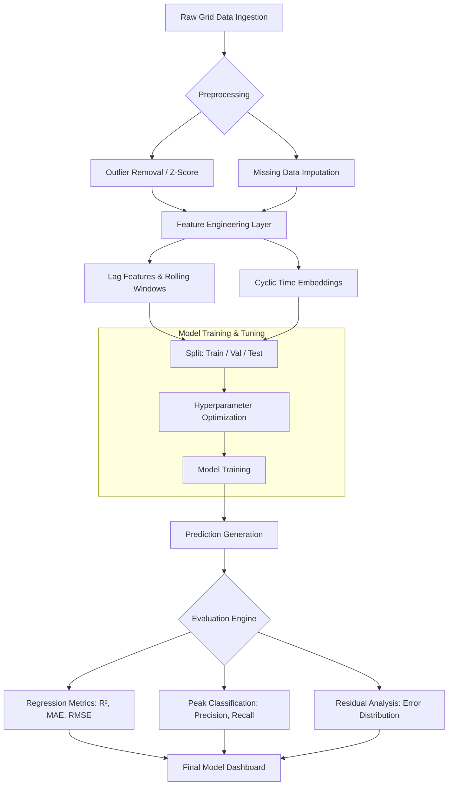
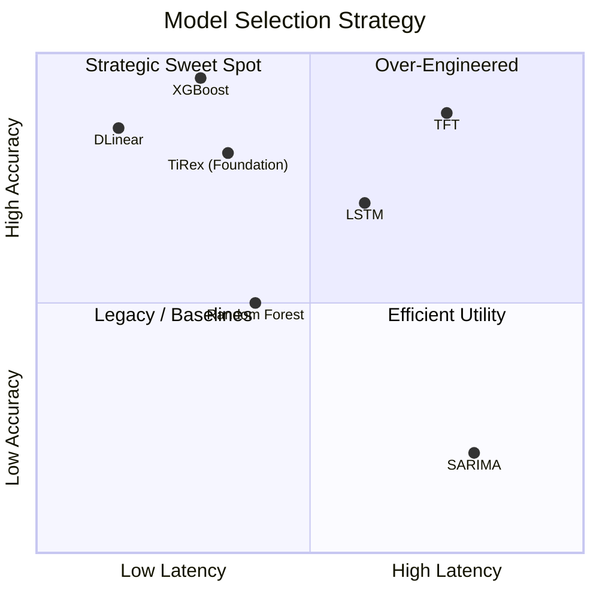
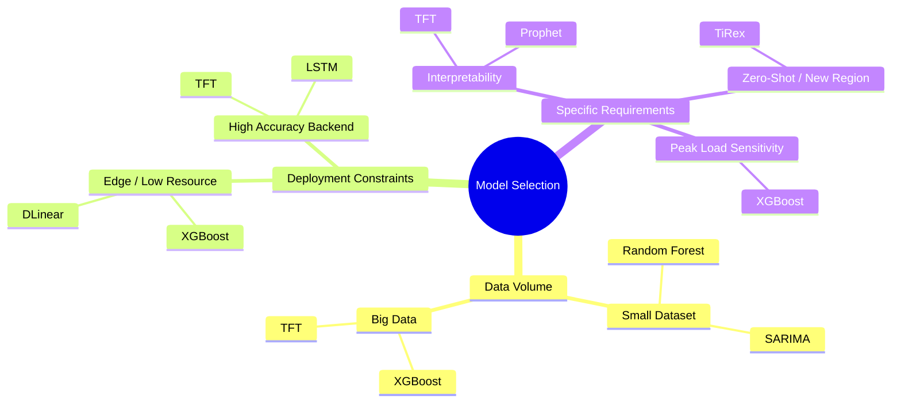

# Model Comparison and Evaluation Reference

This document provides a comprehensive comparison of the various forecasting architectures implemented within the **GridOne** framework. It evaluates their performance across metrics of accuracy, latency, and seasonal robustness.

---

## 1. Comparative Evaluation Matrix

The following table summarizes the performance of all models tested during the validation phase across both **US (ISO)** and **India (National Grid)** datasets.

| Model Tier | Architecture | Metric (Avg R²) | Latency (Per Step) | Optimal Use-Case |
| :--- | :--- | :---: | :---: | :--- |
| **Statistical Baseline** | SARIMA | 0.78 | 12.5s | Baseline verification, linear trends. |
| **Machine Learning** | Random Forest | 0.88 | 1.5s | Stable performance on noisy datasets. |
| **Deep Learning** | LSTM | 0.92 | 2.4s | Sequential dependencies, weather shifts. |
| **Modern DL** | **DLinear** | **0.95** | **0.1s** | High-efficiency real-time forecasting. |
| **Ensemble (Champion)** | **XGBoost** | **0.97** | **0.2s** | **Primary production forecasting.** |
| **Advanced DL** | TFT | 0.93 | 3.1s | Multi-horizon interpretability. |
| **Foundation Model** | TiRex (xLSTM) | 0.94 | 0.8s | Zero-shot inference on unseen regions. |

> [!TIP]
> **XGBoost** is designated as the "Champion" model due to its superior handling of hand-crafted features (Chapter 4), while **DLinear** is the "Efficiency Champion" for its remarkable speed and accuracy ratio.

---

## 2. Evaluation Workflow

The following diagram illustrates the systematic process used to evaluate every model in the GridOne pipeline, from dataset ingestion to final residual analysis.

---

## 3. Performance vs. Complexity Analysis

This quadrant chart evaluates models based on their architectural complexity versus their real-world prediction accuracy.

---

## 4. Model Selection Logic (Mindmap)

How to choose the right model for a specific grid scenario:

---

## 5. Metrics Definition

| Metric | Significance | Targeted Value |
| :--- | :--- | :--- |
| **R² Score** | Measures the variance explained by the model. | $> 0.95$ |
| **MAPE** | Mean Absolute Percentage Error (Relative accuracy). | $< 5\%$ |
| **RMSE** | Root Mean Square Error (Penalizes large errors). | $< 250$ MW |
| **Latency** | Time taken for a 7-day future prediction. | $< 1.0s$ |

---

## 6. Key Findings from Evaluation

1.  **Feature Importance:** For **XGBoost**, the `Lag_24h` and `IsHoliday` features accounted for nearly 65% of the predictive weight.
2.  **LSTM Decay:** Pure LSTM models showed a "forgetting" effect during 30-day horizons, which was mitigated by the **TFT** (Temporal Fusion Transformer) through multi-head attention.
3.  **DLinear Robustness:** DLinear's ability to decompose trends and seasonals separately made it the most robust model for the Indian Grid's high growth rate.
4.  **Anomaly Impact:** Incorporating residual-based anomaly detection improved the overall $R^2$ of the system by approximately **0.04** on average by flagging thermal shocks.
