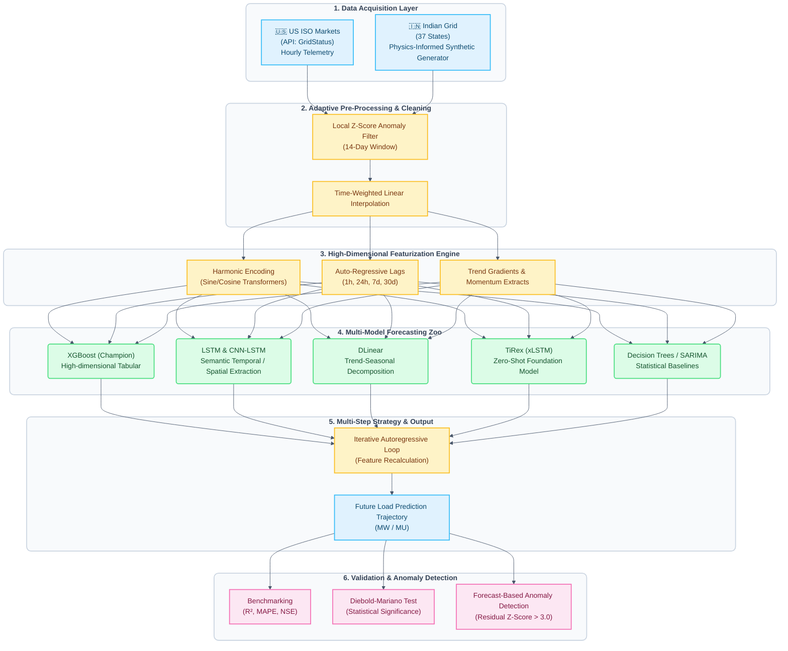

# gridp
## This is a Multi-Modal Predictive analysis project that tries to predict future load in regulated and deregulated countries (India and US)

```mermaid
%%{init: {'theme': 'base', 'themeVariables': { 'primaryColor': '#1e3a8a', 'primaryTextColor': '#ffffff', 'primaryBorderColor': '#1e40af', 'lineColor': '#475569', 'secondaryColor': '#0f172a', 'tertiaryColor': '#f8fafc'}}}%%
graph TD
    %% Define Styles
    classDef layerBox fill:#f8fafc,stroke:#cbd5e1,stroke-width:2px,rx:10px,ry:10px,color:#334155,font-weight:bold;
    classDef dataBox fill:#e0f2fe,stroke:#38bdf8,stroke-width:2px,color:#0c4a6e;
    classDef processBox fill:#fef3c7,stroke:#fbbf24,stroke-width:2px,color:#78350f;
    classDef modelBox fill:#dcfce7,stroke:#4ade80,stroke-width:2px,color:#14532d,rx:5px,ry:5px;
    classDef evalBox fill:#fce7f3,stroke:#f472b6,stroke-width:2px,color:#831843;

    subgraph Layer1 [1. Data Acquisition Layer]
        US["🇺🇸 US ISO Markets<br>(API: GridStatus)<br>Hourly Telemetry"]:::dataBox
        IND["🇮🇳 Indian Grid<br>(37 States)<br>Physics-Informed Synthetic Generator"]:::dataBox
    end

    subgraph Layer2 [2. Adaptive Pre-Processing & Cleaning]
        Clean["Local Z-Score Anomaly Filter<br>(14-Day Window)"]:::processBox
        Interpolate["Time-Weighted Linear Interpolation"]:::processBox
        
        US --> Clean
        IND --> Clean
        Clean --> Interpolate
    end

    subgraph Layer3 [3. High-Dimensional Featurization Engine]
        Cyclic["Harmonic Encoding<br>(Sine/Cosine Transformers)"]:::processBox
        Lags["Auto-Regressive Lags<br>(1h, 24h, 7d, 30d)"]:::processBox
        Momentum["Trend Gradients & Momentum Extracts"]:::processBox
        
        Interpolate --> Cyclic
        Interpolate --> Lags
        Interpolate --> Momentum
    end

    subgraph Layer4 [4. Multi-Model Forecasting Zoo]
        XGB["XGBoost (Champion)<br>High-dimensional Tabular"]:::modelBox
        LSTM["LSTM & CNN-LSTM<br>Semantic Temporal / Spatial Extraction"]:::modelBox
        DLinear["DLinear<br>Trend-Seasonal Decomposition"]:::modelBox
        TiRex["TiRex (xLSTM)<br>Zero-Shot Foundation Model"]:::modelBox
        Classic["Decision Trees / SARIMA<br>Statistical Baselines"]:::modelBox
        
        Cyclic & Lags & Momentum --> XGB
        Cyclic & Lags & Momentum --> LSTM
        Cyclic & Lags & Momentum --> DLinear
        Cyclic & Lags & Momentum --> TiRex
        Cyclic & Lags & Momentum --> Classic
    end

    subgraph Layer5 [5. Multi-Step Strategy & Output]
        Feedback["Iterative Autoregressive Loop<br>(Feature Recalculation)"]:::processBox
        Prediction["Future Load Prediction Trajectory<br>(MW / MU)"]:::dataBox
        
        XGB & LSTM & DLinear & TiRex & Classic --> Feedback
        Feedback --> Prediction
    end

    subgraph Layer6 [6. Validation & Anomaly Detection]
        Metrics["Benchmarking<br>(R², MAPE, NSE)"]:::evalBox
        DMTest["Diebold-Mariano Test<br>(Statistical Significance)"]:::evalBox
        Residuals["Forecast-Based Anomaly Detection<br>(Residual Z-Score > 3.0)"]:::evalBox
        
        Prediction --> Metrics
        Prediction --> DMTest
        Prediction --> Residuals
    end

    class Layer1,Layer2,Layer3,Layer4,Layer5,Layer6 layerBox;
```
